# Diagrama de Execução dos Scripts CodeDeploy

Este diagrama mostra como os scripts definidos no `appspec.yml` são executados durante um deployment do AWS CodeDeploy.

```mermaid
flowchart TD
    Start([Deployment Iniciado]) --> BeforeInstall

    BeforeInstall[BeforeInstall Hook]
    BeforeInstall --> InstallDeps["install_dependencies.sh<br/>- Instala Java 17 Corretto<br/>- Cria usuário appuser<br/>- Cria diretório /opt/app<br/>- Timeout: 5 min"]

    InstallDeps --> FileCopy
    FileCopy["File Copy Phase<br/>- Copia JAR para /opt/app<br/>- Copia scripts/<br/>- Aplica permissões"]

    FileCopy --> AppStop
    AppStop[ApplicationStop Hook]
    AppStop --> StopApp["stop_application.sh<br/>- Verifica aplicação rodando<br/>- Para processo via PID<br/>- Remove PID file<br/>- Timeout: 1 min"]

    StopApp --> AfterInstall
    AfterInstall[AfterInstall Hook]
    AfterInstall --> InstallService["install_systemd_service.sh<br/>- Cria systemd service<br/>- Configura auto-start<br/>- Define usuário appuser<br/>- Timeout: 2 min"]

    InstallService --> AppStart
    AppStart[ApplicationStart Hook]
    AppStart --> StartApp["start_application.sh<br/>- Encontra JAR da aplicação<br/>- Verifica se já está rodando<br/>- Inicia como appuser<br/>- Timeout: 5 min"]

    StartApp --> ValidateService
    ValidateService[ValidateService Hook]
    ValidateService --> ValidateApp["validate_service.sh<br/>- Testa /healthcheck<br/>- 15 tentativas com 2s<br/>- Verifica HTTP 200<br/>- Timeout: 2 min"]

    ValidateApp --> Success{Validação OK?}
    Success -->|Sim| Complete([Deployment Concluído])
    Success -->|Não| Rollback([Deployment Falhou<br/>Rollback Acionado])

    %% Styling
    classDef hookStyle fill:#e1f5fe,stroke:#01579b,stroke-width:2px
    classDef scriptStyle fill:#f3e5f5,stroke:#4a148c,stroke-width:2px
    classDef phaseStyle fill:#e8f5e8,stroke:#2e7d32,stroke-width:2px
    classDef successStyle fill:#e8f5e8,stroke:#2e7d32,stroke-width:3px
    classDef errorStyle fill:#ffebee,stroke:#c62828,stroke-width:3px

    class BeforeInstall,AppStop,AfterInstall,AppStart,ValidateService hookStyle
    class InstallDeps,StopApp,InstallService,StartApp,ValidateApp scriptStyle
    class FileCopy phaseStyle
    class Complete successStyle
    class Rollback errorStyle
```



    class InstallDeps,StopApp,InstallService,StartApp,ValidateApp scriptStyle
    class FileCopy phaseStyle
    class Complete successStyle
    class Rollback errorStyle

```

## 📋 Explicação Detalhada dos Scripts

### 1. **install_dependencies.sh** (BeforeInstall)
**Função:** Preparar o ambiente para a aplicação
- Instala Java 17 Amazon Corretto se não estiver presente
- Cria usuário `appuser` para execução da aplicação
- Cria diretório `/opt/app` com permissões adequadas
- Registra logs em `/var/log/app_install.log`

### 2. **Fase de Cópia de Arquivos** (Automática)
**Função:** Copiar arquivos da aplicação
- Copia JAR da aplicação para `/opt/app/`
- Copia scripts para `/opt/app/scripts/`
- Aplica permissões definidas no `appspec.yml`

### 3. **stop_application.sh** (ApplicationStop)
**Função:** Parar aplicação anterior (se existir)
- Verifica PID file em `/var/run/app.pid`
- Para processo graciosamente
- Force kill se necessário
- Remove PID file

### 4. **install_systemd_service.sh** (AfterInstall)
**Função:** Configurar serviço systemd
- Cria arquivo de serviço em `/etc/systemd/system/contador-app.service`
- Configura auto-start da aplicação
- Define usuário `appuser` para execução
- Configura redirecionamento de logs

### 5. **start_application.sh** (ApplicationStart)
**Função:** Iniciar a nova versão da aplicação
- Localiza JAR da aplicação
- Verifica se já está rodando
- Inicia aplicação como `appuser`
- Cria PID file para controle

### 6. **validate_service.sh** (ValidateService)
**Função:** Validar que aplicação está funcionando
- Testa endpoint `http://localhost:8080/healthcheck`
- Faz até 15 tentativas com 2 segundos de intervalo
- Considera sucesso apenas com HTTP 200
- Falha o deployment se não conseguir validar

## 🔄 Fluxo de Falhas e Rollback

Se qualquer script falhar ou atingir timeout:
1. **Deployment é marcado como falhou**
2. **Rollback automático é acionado** (se configurado)
3. **Versão anterior é restaurada**
4. **Logs detalhados ficam disponíveis** no AWS Console

## ⏱️ Timeouts Configurados

| Hook | Script | Timeout | Descrição |
|------|--------|---------|-----------|
| BeforeInstall | install_dependencies.sh | 5 min | Instalação pode ser demorada |
| ApplicationStop | stop_application.sh | 1 min | Stop deve ser rápido |
| AfterInstall | install_systemd_service.sh | 2 min | Configuração systemd |
| ApplicationStart | start_application.sh | 5 min | Start pode demorar |
| ValidateService | validate_service.sh | 2 min | Validação com retry |

## 🛡️ Segurança e Usuários

- **Scripts de sistema:** Executados como `root`
- **Aplicação:** Executada como `appuser` (sem privilégios)
- **Logs:** Centralizados em `/var/log/`
- **Permissões:** Configuradas automaticamente
```
